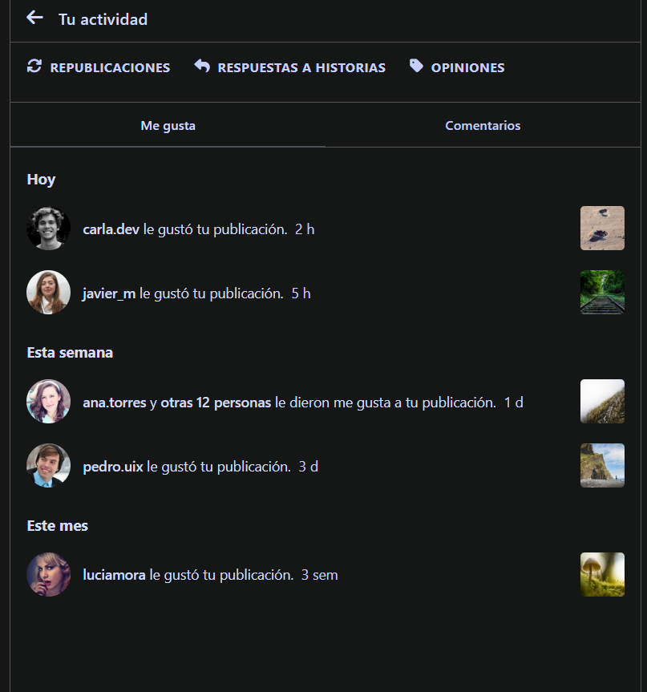
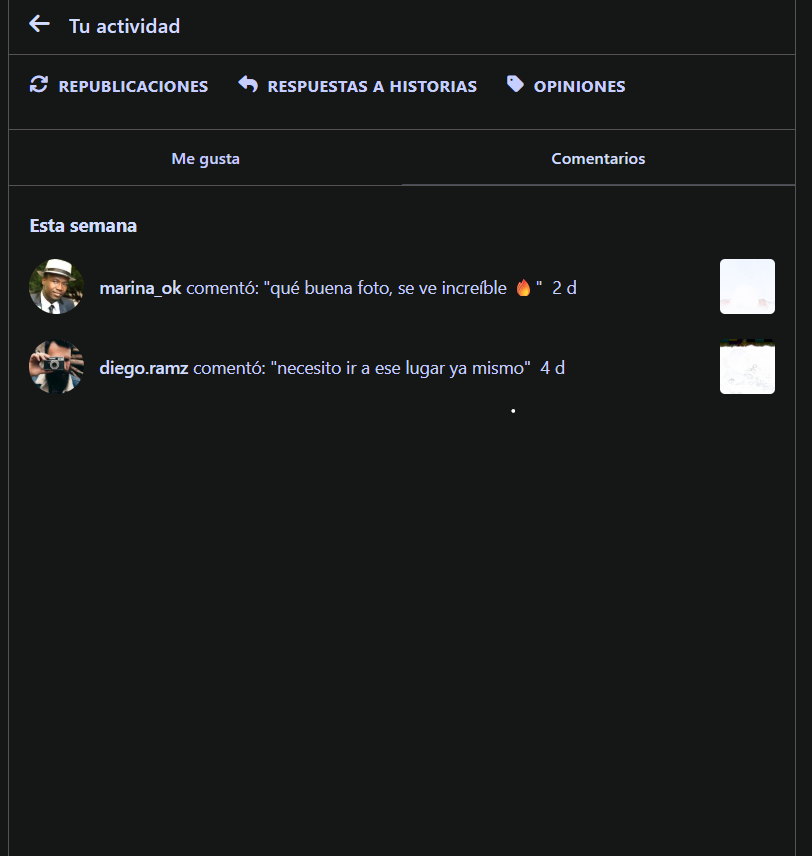
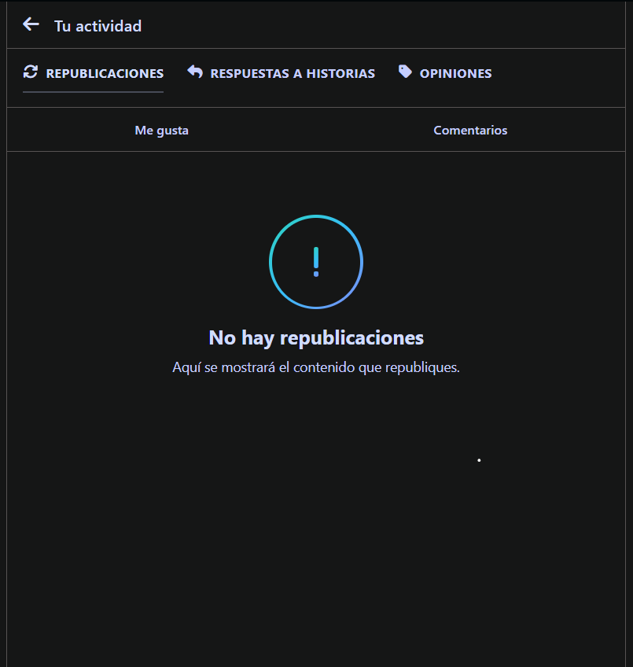
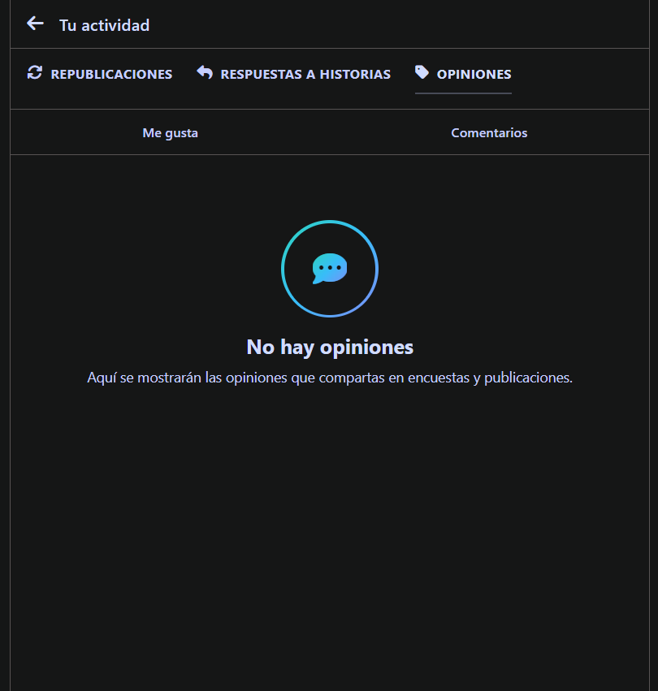

Sección Actividad

En esta sección se desarrolló la interfaz de Actividad, inspirada en el diseño de Instagram.

Cambios realizados
Se creó la página actividad.html.
Se separaron los estilos en styles.css.
Se implementaron las secciones de Me gusta, Comentarios, Republicaciones, Respuestas a historias y Opiniones.
Se agregaron interacciones para navegar entre las diferentes secciones.
Se utilizó una paleta de colores inspirada en Instagram.
Se organizaron los estilos CSS para facilitar su mantenimiento.
Estructura
Seccion-Actividad/
├── actividad.html
├── styles.css
├── README.md
└── imagenes-prototipo/
    ├── likes.png
    ├── comentarios.png
    ├── reposts.png
    ├── respuestas.png
    └── opiniones.png

Capturas de pantalla

Me gusta

Comentarios

Republicaciones

Respuestas a historias

Opiniones

